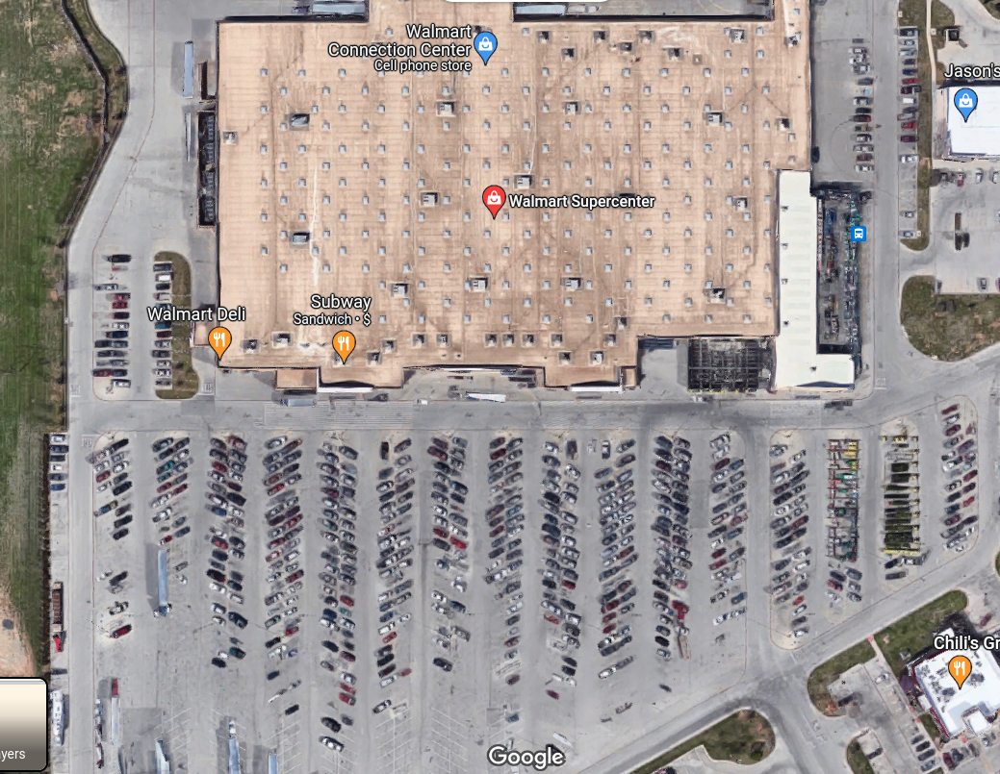
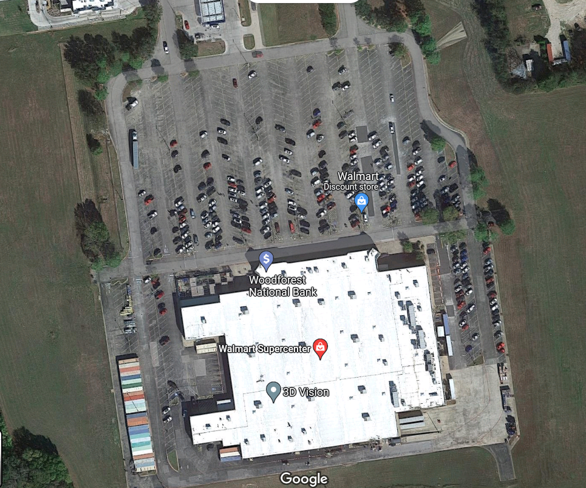

## Estacionamiento y Fermi-statistics

Estas son algunas fotos de estacionamientos de Walmart:

Y esta la distirbución de ocupación de electrones en un sólido, o distribución de Fermi:

Parecería que uno puede modelar la ocupación de lugares d estacionamiento en un Walmart (o en un estadio, o una fiesta, etc) como electrones de conducción en un sólido, utilizando la distribución de Fermi.  Donde se reduce la distribución a pocos parámetros efectivos, como p.ej. la temperatura, nivel de ocupación, etc.

Si esto fuese así, entonces en principio uno podría ir llegando al Walmart (o un estadio, etc) y a partir de las observaciones determinar cuál es la probabilidad de encontrar un lugar de estacionamiento más cerca aun.  Se anima a pensar cómo hacerlo ?

